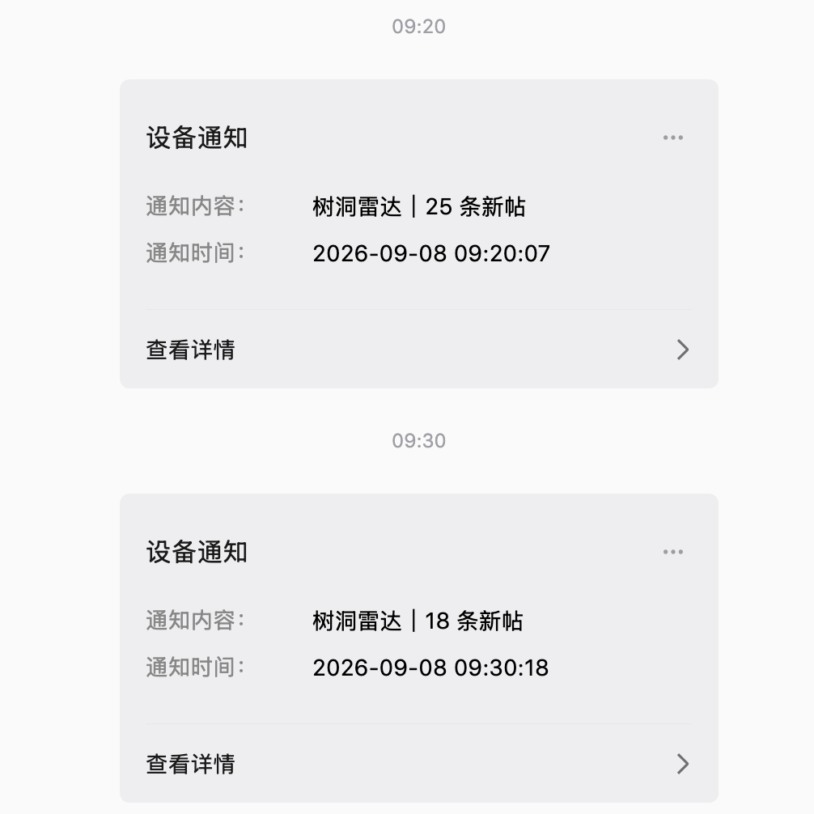
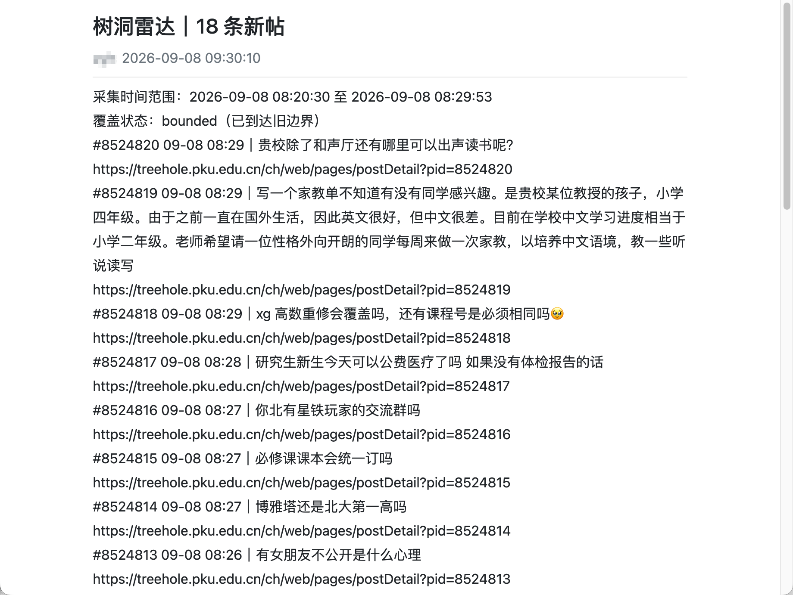

# PKUHoleRadar

`pku-hole-radar` 是一个单进程、SQLite、本地定时运行的北大树洞新帖提醒工具。它按帖子
ID 去重，支持可选关键词筛选和跨轮累计，并按“累计数量阈值或关注主题”生成 PushPlus 微信
通知。只有命中关注主题时才补读该帖当前公开可见的完整回复；项目不提供 Web 服务、不抓取
历史全量、不下载媒体、不调用 AI。

当前状态：离线采集、分页去重、筛选、简报、outbox 与失败恢复已实现；仓库包含真实联调的
接口记录和消息展示示例。真实接口不是稳定的公开 API；`accepted` 只表示 PushPlus 服务端
受理，不能替代每个部署环境的树洞连接和微信收件验证。接口证据与已知限制见
[接口研究记录](docs/INTEGRATION.md)。

## 使用边界

本项目是非官方个人项目，与北京大学及北大树洞没有隶属、合作或背书关系。北大树洞当前服务
协议对非官方客户端、自动脚本以及内容传播设有限制。使用者必须自行阅读并遵守适用的平台协议、
学校规定和法律，并在获得所需授权后使用；本项目不提供账号、不绕过认证，也不附带任何真实
树洞内容。

## 安装与平台

项目要求 Python 3.11+。代码使用 POSIX 文件锁；原生 Windows 不在支持范围内。macOS 提供
LaunchAgent 定时模板，Linux 可以使用 CLI 配合系统自己的定时器，但仓库不提供 Linux 服务文件。
在 macOS 或 Linux 的项目根目录执行：

```bash
git clone https://github.com/YXingo/pku-hole-radar.git
cd pku-hole-radar
python3.11 -m venv .venv
.venv/bin/python -m pip install -e '.[dev]'
cp -n config.example.toml config.toml
cp -n .env.example .env
chmod 600 .env
```

`config.toml` 和 `.env` 都是本地文件，不要提交到版本库，也不要把 token、Cookie 或原始
响应粘贴到对话中。状态目录默认为 `var/`，数据库、锁和日志均留在本机；`cp -n` 会保留已有
本地配置。

## 先做离线验证

示例配置没有真实接口地址和凭据，因此可以安全执行：

```bash
.venv/bin/python -m pku_hole_radar --config config.example.toml doctor
.venv/bin/python -m pku_hole_radar --config config.example.toml preview --fixture tests/fixtures/basic.json
.venv/bin/python -m pytest
.venv/bin/python -m ruff check .
.venv/bin/python -m ruff format --check .
```

fixture 预览使用临时数据库，stdout 的 `accepted` 只表示本地输出已接收，不代表微信收到。

## 配置真实接入

先阅读 `docs/INTEGRATION.md`，只使用你在合法登录会话中实际观察到的接口地址、字段和链接。
当前记录的列表接口是 `/chapi/api/v3/hole/list_comments`，但它不是平台稳定公开 API；不要
仅凭示例地址猜测接口。首次 `probe-source` 可以暂时留空 `source.post_url_template`，正式
运行前必须补上经确认的固定链接模板，并把 `contract_confirmed` 改为 `true`。

`.env` 中只填写本地值：

```dotenv
PKUHOLE_TOKEN=...
PKUHOLE_UUID=...
PKUHOLE_XSRF_TOKEN=...
PKUHOLE_COOKIE_PKU_TOKEN=...
PKUHOLE_SESSION_COOKIE=...
PUSHPLUS_TOKEN=...
```

`PKUHOLE_TOKEN` 必须来自当前浏览器请求或本地登录会话；`PKUHOLE_UUID`、
`PKUHOLE_XSRF_TOKEN`、`PKUHOLE_COOKIE_PKU_TOKEN` 和 `PKUHOLE_SESSION_COOKIE` 只有在
请求中实际存在且确实需要时填写。程序不会自动登录。PushPlus 只在 `[notify] provider =
"pushplus"` 时需要 token；离线预览使用 `stdout`，不发送网络请求。

先保持 `source.contract_confirmed = false`，执行：

```bash
.venv/bin/python -m pku_hole_radar --config config.toml doctor
.venv/bin/python -m pku_hole_radar --config config.toml probe-source
```

`probe-source` 只读取最新一页，不建立业务基线、不生成 outbox、不构造简报，也不会因数据库
已有基线而自动翻到旧页；输出会报告实际解析数量、PID 顺序和置顶数量。一次探测中的重试仍
可能产生多于一个 HTTP 请求，终端会显示请求数。它仍遵守请求超时和整轮运行预算。
只有你确认返回字段、排序和分页语义后，才将 `contract_confirmed` 改为 `true`。之后可用
`preview --live` 查看候选；它不改生产基线或 outbox，但会读取真实列表并受运行预算约束。

建议分两条链路、按以下顺序联调：

1. 先把 `[notify] provider` 从示例的 `stdout` 改成 `pushplus`，仅在本地 `.env` 填写
   `PUSHPLUS_TOKEN`，执行 `notify-test`。它只发送合成文本、不访问树洞；服务端返回受理流水号
   只能证明 PushPlus 已受理，不等于微信实际收到。`channel = "wechat"` 通常显示为微信服务号
   通知卡片；用户主动向 PushPlus 服务号发送激活消息后，平台可能在有限时间/条数内使用客服
   消息，但项目不能强制永久保持该展示形态。
2. 再填写树洞会话字段，保持 `source.contract_confirmed = false`，执行 `probe-source`。
   根据返回的字段、分页、排序和手机链接逐项确认后，才在本地改为 `true`；不要把测试 fixture
   的路径当作官网链接。
3. 先执行 `preview --live` 检查候选，再执行一次 `run-once --source live`。首次正式成功采集
   只建立基线，不通知启动前旧帖。

通知渠道的远端限流和发送预算会同时约束正常批次、`notify-test` 和人工重新排队后的发送，并在重启后保留。遇到
`unknown` 或 `failed`，先执行 `status` 找到批次 ID，再用 `outbox list --status unknown`
或 `outbox list --status failed` 查看结构化错误，最后按确认结果执行 `outbox retry ID`
（unknown 需追加 `--ack-possible-duplicate`）或 `outbox discard ID`。

真实运行入口是：

```bash
.venv/bin/python -m pku_hole_radar --config config.toml run-once --source live
```

首次成功列表页只建立基线，不通知启动前旧帖。没有匹配新帖不会创建消息；未达到通知条件的
匹配帖会在本机保留完整正文并继续累计。采集不完整会保留旧水位并在状态和简报中标明
`incomplete`。`status`、`posts --batch ID`、`outbox list`
以及 `outbox retry ID [--ack-possible-duplicate]` / `outbox discard ID` 用于本地恢复。

## 采集范围与消息展示范围

这两个范围必须分开理解：

- 采集器会按接口分页，直到到达旧水位、来源声明结束、检测到分页异常，或整轮预算结束。
  示例中的 `max_pages = 0`、`max_posts = 0`、`max_requests = 0` 表示不设置本地页数、帖子数
  或请求次数上限；它们不取消接口自身的分页、重复页检测、请求间隔和 `run_timeout_seconds`
  整轮预算。网络或来源异常时，程序应报告 `incomplete`，不会推进旧水位。
- 简报默认 `max_items = 20`，只控制消息正文展开数量，不控制采集和去重。设置为 `0` 会尝试
  展开本批次全部匹配帖子，但仍受 `max_message_chars` 和 PushPlus 单条消息限制；超过总长度时，
  “采集到”不等于“正文全部展示”。所有帖子 ID 仍保存在本地批次中，不会在下一轮自动重复推送。
  用下面的命令查看某个批次的完整本地帖子记录：

  ```bash
  .venv/bin/python -m pku_hole_radar --config config.toml posts --batch BATCH_ID
  ```

- `notify.push_when_post_count_exceeds` 使用严格大于语义。值为 `100` 时，累计到第 101 条
  匹配帖才触发普通通知；任一累计帖命中已启用的关注规则时会立即触发，不等待数量阈值。
  未触发的帖子跨进程重启保留，触发后一次性归入同一通知组。
- 关注通知将关注帖排在普通帖之前，展示原帖全文和当时全部公开可见回复。若全文超过单条
  消息上限，会自动拆成带顺序编号的多个分片；同组分片优先连续发送，正文不会因分片丢失。

默认发布示例的 20 条展示上限是消息大小保护，不是树洞每轮只能发现 20 或 30 条。要改为尽量
全部展开，可在本地配置中使用：

```toml
[notify]
max_items = 0
max_message_chars = 20000
push_when_post_count_exceeds = 100
```

`run_timeout_seconds = 180` 是请求和本轮编排的总预算。真实来源与 PushPlus 的有界请求使用
可取消的异步 HTTP 路径；若来源请求超时，不提交本轮采集结果；若通知请求已经启动但无法确认
结果，则记为 `unknown`，不会自动重发造成重复消息。

每轮采集完成后，程序优先发送本轮刚生成的当前批次，保证定时触发看到的是上一个采集区间的
最新帖子；随后在同一轮剩余预算内继续排空已经到期的 pending 批次。批次之间默认间隔 13 秒，
以遵守 PushPlus 每分钟 5 次的频率限制，可通过 `notify.send_spacing_seconds` 调整。渠道仍在冷却、
当日额度耗尽或运行预算不足时，未发送完的积压保留到下一轮，但不再阻塞下一轮当前批次。

## 关注摘要（可选）

微信模板卡片通常优先展示标题。开启关注摘要后，程序会用本地规则识别实习、科研和相关交流；
命中本身就是一个通知触发条件，相关帖子会排在前面并补齐当时的公开回复。它不会改变采集、
去重、水位或既有 `filters.include_any` 的语义，也不会调用 AI。

公开配置默认关闭：

```toml
[attention]
enabled = false
career_enabled = false
title_max_chars = 40
max_title_categories = 2
preferred_locations = []
```

用户可在本地 `config.toml` 中开启，并按优先顺序设置地点。针对 LLM4SE、Agent、实习和科研
招募的配置示例：

```toml
[attention]
enabled = true
title_max_chars = 40
max_title_categories = 2
preferred_locations = ["深圳", "远程"]

[attention.keywords]
llm4se = ["LLM4SE", "AI4SE", "代码智能", "coding agent", "SWE-bench"]
llm = ["大模型", "大语言模型", "大型语言模型", "LLM", "LLMs"]
agent = ["智能体", "AI Agent", "多智能体", "coding agent", "Agent"]
```

未在配置中列出的分组沿用通用预设；把某个分组显式设为 `[]` 可关闭它。`深圳` 和 `远程` 只
用于排序偏好，不是硬筛选条件。标题可能类似 `实习2·科研1｜43帖` 或 `实习2｜深圳 coding
agent…｜43帖`；无命中时使用普通标题 `树洞雷达｜101 条新帖`。这只是关键词规则线索，不代表
职位仍在招聘、岗位真实有效或一定适合用户。

可覆盖的分组及用途是：`llm4se`（LLM4SE/软件工程大模型）、`software_engineering`（代码
生成/程序修复/测试生成等任务）、`llm`（大模型）、`agent`（Agent）、`internship`（实习）、
`research`（研究助理/科研合作）、`recruitment`（招募信号）、`supporting_recruitment`
（内推/岗位/投递等辅助信号）、`help_seeking`（求实习/求内推等求助语境）、`experience`
（面经/投稿/复现等经验）、`shenzhen`（深圳）、`remote`（远程）和 `secondary`（RAG/工具
调用/微调等辅助技术）。

`notify.content_mode = "links_only"` 时，关注分类和计数仍可用于标题与详情排序，但不会向
通知正文写入原文片段或命中词。关闭 `attention.enabled` 即恢复旧标题和旧排序；已保存的
outbox 批次不会因修改词库而重新生成。

### 职业发展关注（单独开启）

在 `[attention]` 中设置 `enabled = true` 和 `career_enabled = true`，可将行业选择、薪资待遇、
工作强度、就业前景和技术岗位替代风险纳入关注。默认 `career_enabled = false`，升级后原有
关注范围保持兼容。新主类别为“职业发展”，标题使用“职业”，排序为实习线索、科研线索、
职业发展、相关交流、其他；同一帖子仍只计一次。`max_title_categories` 可设为 1–4。

关注对象也包含央国企（兼容“国央企”）、公务员、事业单位/事业编和体制内，
不局限于互联网或技术岗位。单纯考公报名、准考证打印或办事咨询不会因出现单位/岗位名而自动触发。

职业规则不要求命中大模型或 Agent。判断依据是同一句里的“行业/单位/岗位 + 职业议题”，
或完整的求职择业表达（例如“offer 怎么选”“毕业后找不到工作”）。相邻两句仅在前句已有
岗位/offer 等就业语境，后句明确承接待遇或该岗位时组合；不跨空行、分号、显式转话题或
独立主体拼接。比如“收到国企的 offer。税前 25 万值得去吗？”可以识别，而“银行转账失败。
工资不够花”不会借用银行作为职业对象。

可覆盖词组为 `career_employer`（行业/单位）、`career_role`（职业岗位，含公务员/事业编）、`career_pay`
（待遇）、`career_workload`（强度）、`career_outlook`（就业发展）、`career_tradeoff`（岗位选择）、`career_choice`
（完整求职择业表达）和 `career_displacement`（职业替代）。显式 `[]` 关闭对应分组。AI、公司名、
“算法”或“工资”单独出现不触发；替代风险需确认被替代的是职业角色。正文会显示主题和纳入
理由，且复用现有“关注即触发、原帖全文与完整回复、超长分片”的发送逻辑。

这是可解释的文字规则，并非语义理解保证。短语“就业前景”可能涵盖非技术职业，“国企 + 待遇”
也可能是家人退休待遇。短标题“国企”后紧接一行“薪资怎么样”可以识别；多个无关段落不会
拼接。新增合成样本位于
`tests/fixtures/career_attention.json`，其中 `review=边界待确认` 的条目特意保留供部署者判断
兴趣范围，不将这些主观边界当成已验证准确率。

## 首次增量验收

首次正式轮次只建立基线。建议按实际调度运行三轮：

1. 第一次 `run-once` 后确认 `status` 显示基线已建立、outbox 为空。
2. 下一次调度后再运行一轮，确认新增 ID、匹配数、覆盖状态和累计待通知数；只有达到数量阈值
   或命中关注主题才生成通知，超长关注详情可能形成多个有序分片。
3. 重启进程或再次运行相同时间范围，确认相同 PID 不重复进入新批次；若覆盖为 `incomplete`，不要把它当成完整覆盖验收。

常用只读检查：

```bash
.venv/bin/python -m pku_hole_radar --config config.toml status
.venv/bin/python -m pku_hole_radar --config config.toml outbox list --limit 20
```

会话过期时不要删库：重新在浏览器登录并更新本地 `.env`，确认权限仍为 600，再执行
`resume-source`，保留已有基线和去重记录。数据库升级或迁移前先停掉调度任务，并复制
`var/pku-hole-radar.sqlite3` 做本地备份。

## 定时运行

项目只提供 macOS LaunchAgent 模板，不会自行安装或启用后台任务。模板按系统本地时区分时
触发：01:00–07:30 每 30 分钟，08:00 至次日 00:50 每 10 分钟。确认真实接入和合成测试后，
按 [部署说明](deploy/launchd/README.md) 替换绝对路径并安装。卸载任务不会删除数据库。

## 实际效果示例

以下图片是 2026-09-08 的用户实测截图，只证明消息展示形式和一批链接/正文示例，不代表
所有账号、时段或未来平台行为都相同；其中“设备通知”是 PushPlus 的系统通知卡片，不是
微信好友私聊。





## 证据边界

“离线验证通过”“树洞接入验证通过”和“微信渠道验证通过”是三个不同结论。仓库测试只保证
离线行为；每位使用者仍需使用自己的合法会话独立验证真实树洞连接和微信收件。服务端返回
`accepted` 仅表示请求已受理，不等于最终送达。

## 许可证

项目代码以 [MIT License](LICENSE) 发布。该许可证只授权使用本仓库代码，不授予北大树洞
接口、数据、名称、标识或第三方内容的任何权利。
